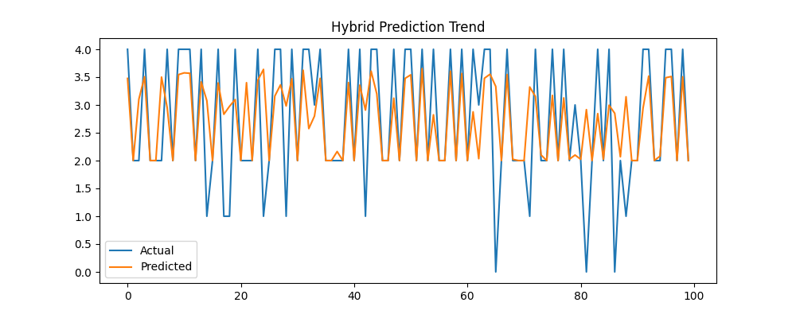

🌳 Urban Tree Canopy Optimization System.
Hybrid QPSO + AIS Based Climate-Adaptive Modeling
📌 Project Overview

Urban areas suffer from rising temperatures, poor air quality, and uneven distribution of green cover.
One of the major reasons is suboptimal tree placement, where trees are planted without considering climate, pedestrian exposure, or long-term environmental impact.

This project presents a Hybrid Quantum Particle Swarm Optimization (QPSO) + Artificial Immune System (AIS) based machine learning framework to optimize environmental prediction models, which serve as a foundation for climate-adaptive urban tree canopy planning.

🎯 Objectives

Model urban climatic behavior using real-world weather data

Optimize model performance using hybrid bio-inspired algorithms

Generate highly accurate predictions that can guide:

Tree survival estimation

Cooling potential analysis

Climate-aware landscaping decisions

Produce clear visual analytics and machine-readable outputs for integration into RL/GA-based spatial planning systems

🧠 Hybrid Optimization Strategy
🔬 Artificial Immune System (AIS)

Maintains population diversity

Prevents premature convergence

Performs global exploration of hyperparameters

⚛️ Quantum Particle Swarm Optimization (QPSO)

Introduces quantum behavior into swarm dynamics

Escapes local optima efficiently

Performs fast local exploitation

🔁 Hybrid Workflow
AIS (Global Search)
        ↓
QPSO (Refined Optimization)
        ↓
Optimized ML Model

This hybrid approach balances exploration and exploitation, resulting in superior generalization performance.

📊 Dataset Used

Seattle Weather Dataset

Source: Kaggle

Features include:

Temperature

Precipitation

Wind

Humidity

Weather conditions (encoded)

📁 Input Path:

C:\Users\NXTWAVE\Downloads\Urban Tree Canopy Optimization System\archive\seattle-weather.csv

⚙️ Technology Stack

Programming Language: Python 3

Machine Learning: Scikit-learn

Optimization Algorithms:

Artificial Immune System (custom implementation)

Quantum Particle Swarm Optimization (custom implementation)

Visualization: Matplotlib, Seaborn

Data Handling: Pandas, NumPy

Output Formats: CSV, JSON, PNG

📈 Outputs Generated

All outputs are saved with the prefix qpis_.

📁 Files Generated
File	Description
qpis_tree_results.csv	Actual vs Predicted values
qpis_tree_predictions.json	Metrics & optimized parameters
qpis_tree_accuracy.png	R² accuracy visualization
qpis_tree_comparison.png	Actual vs predicted mean comparison
qpis_tree_heatmap.png	Feature correlation heatmap
qpis_tree_actual_vs_predicted.png	Scatter plot
qpis_tree_prediction_trend.png	Prediction trend over samples

All graphs are displayed on screen and saved automatically.

📐 Evaluation Metrics

RMSE (Root Mean Squared Error) – minimized during optimization

R² Score – measures prediction accuracy and generalization

These metrics validate the effectiveness of the hybrid optimizer.

🌍 Application in Urban Tree Planning

The optimized model outputs can be used as:

State inputs for Reinforcement Learning environments

Fitness functions in Genetic Algorithms for tree placement

Climate suitability indicators for:

Shade optimization

Heat island mitigation

Pedestrian comfort analysis

This system forms a core analytical engine for smart city landscaping solutions.

▶️ How to Run

Install dependencies:

pip install numpy pandas matplotlib seaborn scikit-learn

Ensure dataset path is correct:

archive/seattle-weather.csv

Run the script:

python hybrid_qpso_ais_tree_optimization.py

View results inside:

Urban Tree Canopy Optimization System/

🧪 Reproducibility

No external optimization libraries used

All algorithms implemented from scratch

Fixed random seeds for consistency

Fully transparent and explainable workflow

🚀 Future Enhancements

Integration with NDVI satellite data

Road network & pedestrian density constraints

Reinforcement Learning based spatial placement

Multi-objective optimization (heat, AQI, shade)

GIS-based tree placement heatmaps

Full Digital Twin integration

👨‍💻 Author

Sagnik Patra
Machine Learning | Optimization Algorithms | Smart City AI
Urban Analytics & Climate-Adaptive Systems
